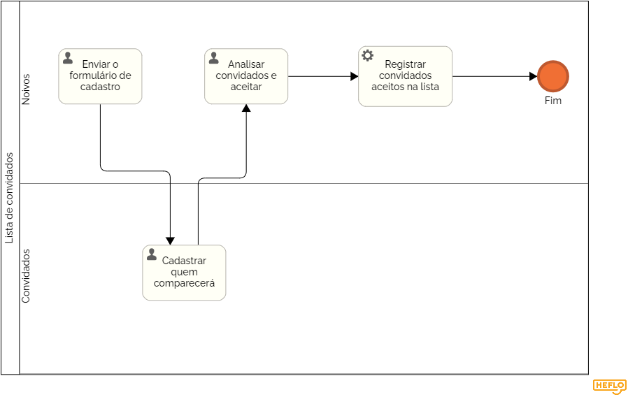

### 3.3.1 Processo 1 – LISTA DE CONVIDADOS

Este processo pode ser melhorado por meio de uma interface intuitiva, upoload de convites personalizados, lembretes de confirmação, relatórios e estatísticas em tempo real dos convidados convidados, inclusão de opção para convidados informarem restrições alimentares.

#### Detalhamento das atividades

_Os tipos de dados a serem utilizados são:_

_* **Enviar o formulário de cadastro** - enviar o link do formulário para convidados._

_* **Cadastrar quem comparecerá** - o convidado preenche o formulário_

_* **Analisar convidados e aceitar** - os noivos recebem a lista de cadastrados e podem excluir aqueles convidados não condizentes._

_* **Registar convidados aceitos na lista** - os convidados aceitos ficam na lista._
                  

**Cadastrar quem comparecerá**

| **Campo**           | **Tipo**         | **Restrições**                               | **Valor default** |
| ---                 | ---              | ---                                          | ---               |
| Nome | Campo de texto        | required                         |      NULL      |
| Email | Campo de texto        | required                          |      NULL       |
| Quantidade de pessoas | Campo numérico        | required                        |      NULL       |
| Nome das pessoas| àrea de texto        | required                          |      NULL       |

| **Comandos**                     |  **Destino**                           | **Tipo**       |                   
| ---                              | ---                                    | ---            |     
| Cadastrar       | Fim da tarefa do convidado        | -              |    

**Analisar convidados e aceitar**

| **Campo**           | **Tipo**         | **Restrições**                               | **Valor default** |
| ---                 | ---              | ---                                          | ---               |
| Lista de convidados | lista        |                        |            |

| **Comandos**                     |  **Destino**                           | **Tipo**       |                   
| ---                              | ---                                    | ---            |     
| Confirmar       | Fim do processo        | -              |    
|  Excluir        | Apaga as informações do convidado no Banco | |

