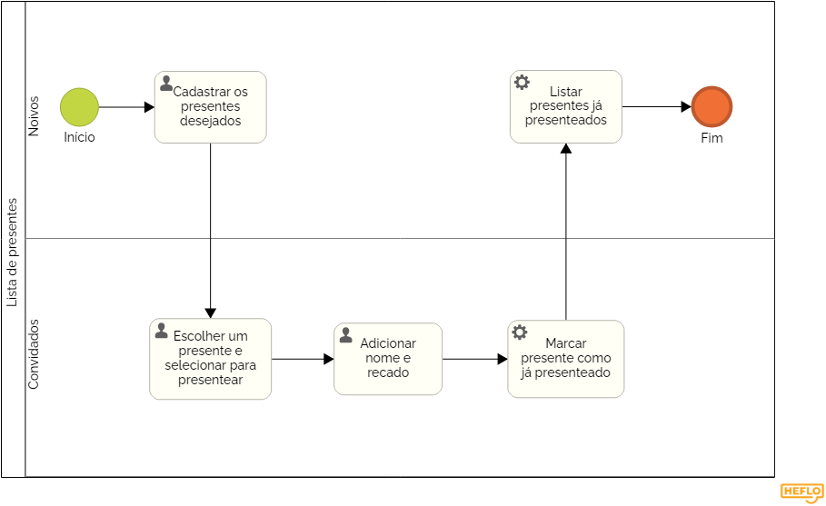

### 3.3.2 Processo 2 – LISTA DE PRESENTES

Este processo pode ser melhorado por meio de um sistema de envio de agradecimentos aos presentes, opções de presentes virtuais como contribuições monetárias, informar o link de acesso à lista de presentes no convite do casamento.

#### Detalhamento das atividades

_**Cadastrar presentes:** os noivos podem cadastrar os presentes desejados_

_**Escolher um presente para presentear:** os convidados podem escolher um presente que eles desejam da lista dos noivos e marcar como presentar._

_**Adicionar nome e recado:** uma tela de pop up aparece para se identificar e inserir uma mensagem para os noivos._

_**Marcar presente como já presenteado:** o presente escolhido fica marcado como já presenteado._

_**Listar presentes já presenteados:** os noivos recebem uma lista dos presentes escolhidos pelos convidados e as mensagens enviadas._

**Cadastrar Presente**

| **Campo**              | **Tipo**         | **Restrições** | **Valor default** |
| ---                    | ---              | ---            | ---               |
| Foto do presente       |       image      |  -             |-
| Nome do presente       |caixa de texto    |  mínimo 1 caractere e máximo 2000 carácteres        |                   |
| Link do presente       | link             |                 |                |
| Descrição do presente  | Caixa de Texto   | mínimo 1 caractere |           |

| **Comandos**         |  **Destino**                   | **Tipo** |
| ---                  | ---                            | ---               |
| Cadastrar Presente   | Cadastro do presente           |           |
| Salvar Presente      | Adiciona presente na view dos convidados  |                   |

**Vizualizar Presente**
| **Campo**              | **Tipo**         | **Restrições** | **Valor default** |
| ---                    | ---              | ---            | ---               |
| Foto do presente       |       image      |  -             |-                  |
| Nome do presente       |caixa de texto    |  mínimo 1 caractere e máximo 2000 carácteres        |                   |
| Link do presente       | link             |                 |                |
| Descrição do presente  | Caixa de Texto   | mínimo 1 caractere |           |

| **Comandos**         |  **Destino**                   | **Tipo** |
| ---                  | ---                            | ---               |
| Escolher Presente    | View de presentes escolhidos dos noivos |           |

**Adicionar Nome e Recado**

| **Campo**              | **Tipo**         | **Restrições** | **Valor default** |
| ---                    | ---              | ---            | ---               |
| Nome | caixa de texto | mín 1 caractere e max 100 caracteres| null |
| Email | caixa de texto | min 1 caractere e max 100 caracteres||
| Recado                 |   área de texto    |  mínimo 1 caractere e máximo 2000 carácteres        |          null      |

| **Comandos**         |  **Destino**                   | **Tipo** |
| ---                  | ---                            | ---               |
| Enviar Recado  | View de presentes escolhidos dos noivos |           |
