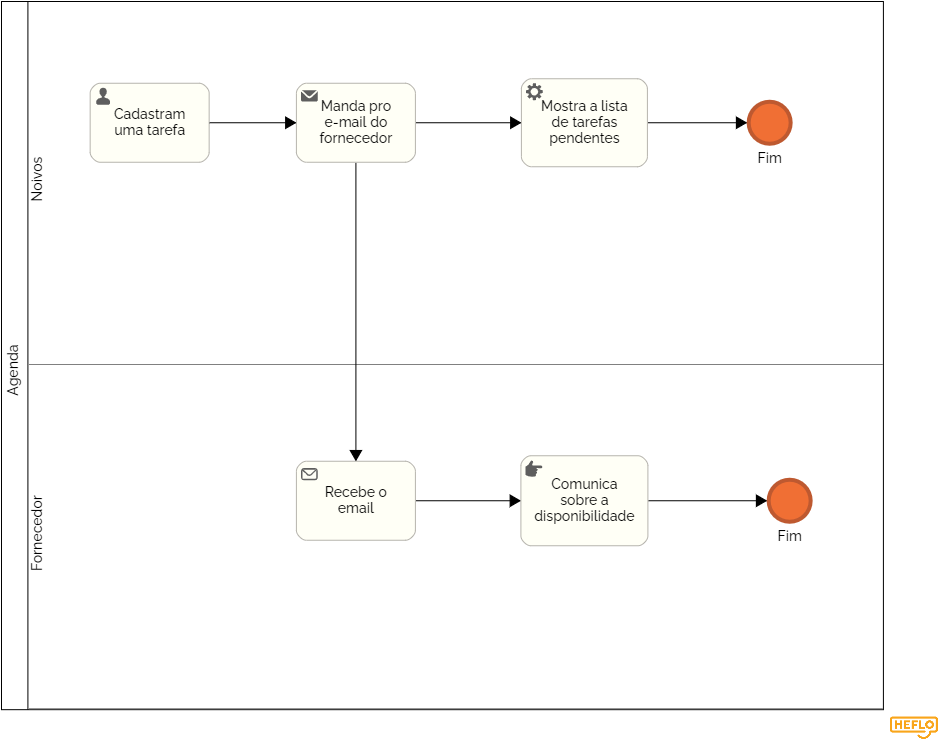

### 3.3.3 Processo 3 – Agenda e registro de tarefas

Este processo pode ser melhorado com a implementação de tags coloridas diferentes para distinguir eventos e uma view do calendário diferente para cada fornecedor mostrando seus eventos.

#### Detalhamento das atividades

- **Cadastra uma tarefa:** Os noivos cadastram uma tarefa pro casamento.

- **Adicioanar compromisso à agenda:** O sistema salva o compromisso no calendário dos noivos e terceiros, caso existam.

- **Receber um pedido de evento:** Os fornecedores são notificados e aceitam ou não o evento. Caso aceitem, é adicionado ao calendário, senão, os noivos são notificados.

- **Receber notificação de falta de disponibilidade** Quando os fornecedores não aceitam um evento, os noivos são notificados através do sistema.

**Cadastro uma tarefa**

| **Campo**       | **Tipo**         | **Restrições** | **Valor default** |
| ---             | ---              | ---            | ---               |
| Data           | Data e Hora   | Apenas datas futuras | Data atual      |
| Fornecedores           | Seleção única |               |                   |
| Email |               |        Area de texto           |

| **Comandos**         |  **Destino**                   | **Tipo** |
| ---                  | ---                            | ---               |
| Salvar               | Confirmar                    |                   |

As atividades de envio e respectivo recebimento do e-mail ocorrem automaticamente
