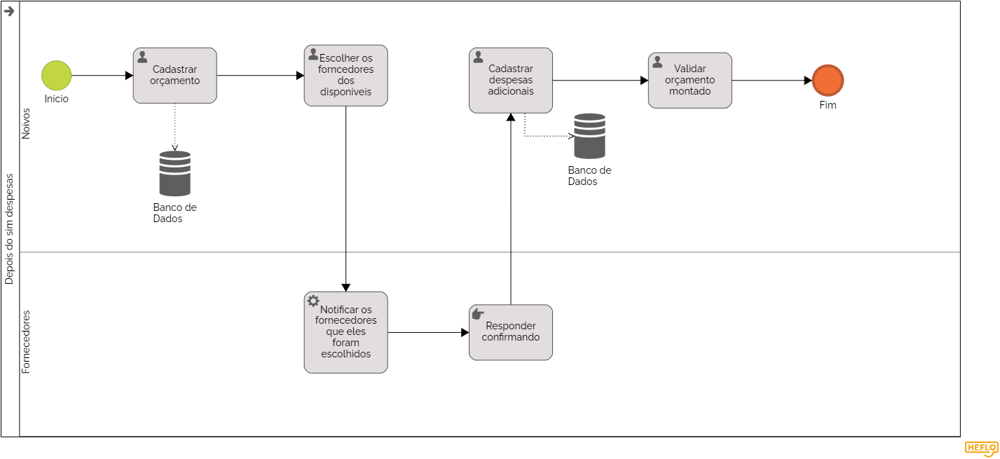

### 3.3.4 Processo 4 – Cadastro de orçamento
Esse processo pode ser melhorado calculando o orçamento cadastrado pelos noivos com o montado por eles após selecionar os fornecedores e cadastrado despesas adicionais e fazer um jogo de cores(vermelho se tiver ultrapassado o valor ou verde enquanto estiver menor), para uma visualização mais didática dos noivos.

#### Detalhamento das atividades

**Cadastro de orçamento:** Esse processo envolve a capacidade dos noivos registrarem um orçamento.

**Mostrar os serviços disponíveis:** Esse processo mostra quais os serviços cadastrados no site, em uma listagem por tipo de serviço, como buffet, fotógrafos, espaços, decoração e atrações, com seus respectivos preços, avaliações e quantidade de pessoas que eles atendem.

**Despesas adicionais:** Esse processo permite aos noivos cadastrar despesas extras, tais como vestido da noiva, e outros insumos não citados anteriormente.

**Validar orçamento:** Esse processo lida com o capacidade dos noivos validarem o orçamento montado por eles, para que eles possam confirmar e seguir adiante com o casamento.

**Cadastro de orçamento**

| **Campo**       | **Tipo**         | **Restrições** | **Valor default** |
| ---             | ---              | ---            | ---               |
| Cadastro de orçamento| Número  |     Apenas numeros positivos       |        R$0,00           |

| **Comandos**         | **Tipo** |
| ---                  | ---       |
| Registrar orçamento|  default |

| **Campo**       | **Tipo**         |
| ---             | ---              |
| Botão confirmar | Seleção única  |

| **Comandos**         |  **Destino**                   | **Tipo** |
| ---                  | ---                            | ---               |
| confirmar se o orçamento cadastrado está correto | Fim atividade 1                 |  default |

**Escolher os fornecedores dos disponiveis**

| **Campo**       | **Tipo**         | **Restrições** | **Valor default** |
| ---             | ---              | ---            | ---               |
| Imagem do fornecedor | Imagem  |               |                   |
|                 |                  |                |                   |

| **Comandos**         |  **Destino**                   | **Tipo**          |
| ---                  | ---                            | ---               |
|  |  | default |
|                      |                                |                   |

| **Campo**       | **Tipo**         | **Restrições** | **Valor default** |
| ---             | ---              | ---            | ---               |
| Preço médio fornecedores| Número  |     Apenas numeros positivos       |        R$0,00           |

| **Comandos**         |  **Destino**                   | **Tipo** |
| ---                  | ---                            | ---               |
| |                 |  default |

| **Campo**       | **Tipo**         | **Restrições** | **Valor default** |
| ---             | ---              | ---            | ---               |
| Descrição breve do forncedor| Area de texto  |    |    |

| **Comandos**         |  **Destino**                   | **Tipo** |
| ---                  | ---                            | ---               |
|  |    |  default |

| **Campo**       | **Tipo**         | **Restrições** | **Valor default** |
| ---             | ---              | ---            | ---               |
| Botão de selecionar fornecedor| Seleção unica  |       |         |

| **Comandos**         |  **Destino**                   | **Tipo** |
| ---                  | ---                            | ---               |
| Salvar fornecedor escolhido | Fim atividade 2                 |  default |

**Cadastrar despesas adicionais**

| **Campo**       | **Tipo**         | **Restrições** | **Valor default** |
| ---             | ---              | ---            | ---               |
| Adicionar novas despesas | Numero  |      valores negativos         |       R$0,00            |
|                 |                  |                |                   |

| **Comandos**         |  **Destino**                   | **Tipo**          |
| ---                  | ---                            | ---               |
| Cadastrar despesas extras/por fora | Fim atividade 3  | default |
|                      |                                |                   |

**Validar orçamento montado**

| **Campo**       | **Tipo**         | **Restrições** | **Valor default** |
| ---             | ---              | ---            | ---               |
| Imagem do fornecedor | Imagem  |               |                   |
|                 |                  |                |                   |

| **Comandos**         |  **Destino**                   | **Tipo**          |
| ---                  | ---                            | ---               |
|  |  | default |
|                      |                                |                   |

| **Campo**       | **Tipo**         | **Restrições** | **Valor default** |
| ---             | ---              | ---            | ---               |
| Preço médio fornecedores| Número  |     Apenas numeros positivos       |        R$0,00           |

| **Comandos**         |  **Destino**                   | **Tipo** |
| ---                  | ---                            | ---               |
| |                 |  default |

| **Campo**       | **Tipo**         | **Restrições** | **Valor default** |
| ---             | ---              | ---            | ---               |
| Descrição breve do forncedor| Area de texto  |    |    |

| **Comandos**         |  **Destino**                   | **Tipo** |
| ---                  | ---                            | ---               |
|  |    |  default |

| **Campo**       | **Tipo**         | **Restrições** | **Valor default** |
| ---             | ---              | ---            | ---               |
| Valor total do orçamento montado| Numero  |  somente valores positivos  |  R$0,00   |

| **Comandos**         |  **Destino**                   | **Tipo** |
| ---                  | ---                            | ---               |
|  |    |  default |

| **Campo**       | **Tipo**         | **Restrições** | **Valor default** |
| ---             | ---              | ---            | ---               |
| Botão de confirmar| Seleção unica  |    |    |

| **Comandos**         |  **Destino**                   | **Tipo** |
| ---                  | Fim do processo 4                           | ---               |
|  |    |  default |

