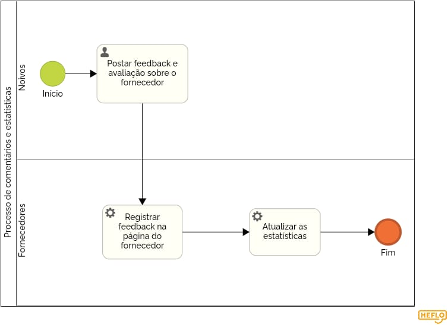

### 3.3.6 Processo 6 – Processo de comentários e estatísticas  

O processo representado abaixo, diz respeito à área do software que terá função de colher informações, comentários e feedbacks de usuários. Essas informações, irão gerar estatísticas que serão exibidas na aplicação. 

#### Detalhamento das atividades

**Postar feedback e avaliação**

| **Campo**       | **Tipo**         | **Restrições** | **Valor default** |
| ---             | ---              | ---            | ---               |
| comentário | área de texto  |   mínimo 1 caractere e máximo 2000 carácteres           |                   |
| avaliação | seleção única  |              |                   |

| **Comandos**         |  **Destino**                   | **Tipo** |
| ---                  | ---                            | ---               |
| Postar comentário | Início do processo de estatísticas  | default |
| Editar avaliação       | Refaz a atividade mais uma vez  |     edit              |
| Excluir avaliação       | Desfaz a atividade  |     delete              |

