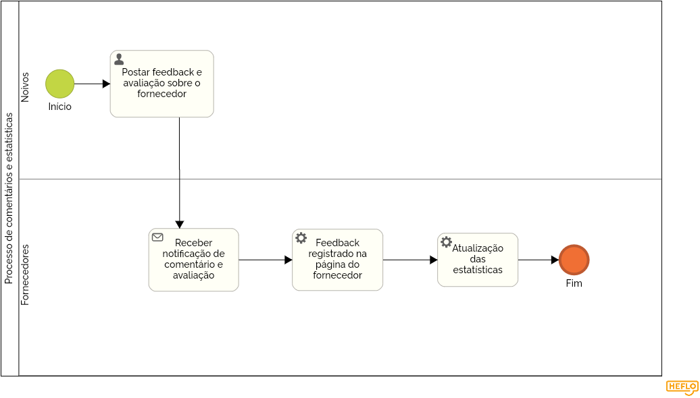

### 3.3.6 Processo 6 – NOME DO PROCESSO

### Processo de comentários e estatísticas 

O processo representado abaixo, diz respeito à área do software que terá função de colher informações, comentários e feedbacks de usuários. Essas informações, irão gerar estatísticas que serão exibidas na aplicação. 

#### Detalhamento das atividades

**Postar comentário sobre o fornecedor:** postar um comentário sobre a experiência dos noivos com os serviços prestados pelo fornecedor, para que esteja exposto em um fórum onde futuros noivos poderão ver. 

**Receber notificação do comentário:** o fornecedor recebe uma notificação, avisando que foi feito um comentário sobre o seu serviço, e pode responder. 

**Avaliar os aspectos sobre o fornecedor:** avaliação de aspectos como tempo de resposta, qualidade do serviço, quantitavamente para uso desses dados. 

**Receber o feedback geral:** o fornecedor recebe o feedback completo com suas estatísticas. 

**Feedback registrado na página do fornecedor:** na página em que os clientes podem visualizar aquele fornecedor, esse feedback fica registrado. 

**Atualização das estatísticas:** as estatísticas sobre aquele fornecedor são atualizadas a cada feedback. 

_Os tipos de dados a serem utilizados são:_

_* **Área de texto** - campo texto de múltiplas linhas_

_* **Caixa de texto** - campo texto de uma linha_

_* **Número** - campo numérico_

_* **Data** - campo do tipo data (dd-mm-aaaa)_

_* **Hora** - campo do tipo hora (hh:mm:ss)_

_* **Data e Hora** - campo do tipo data e hora (dd-mm-aaaa, hh:mm:ss)_

_* **Imagem** - campo contendo uma imagem_

_* **Seleção única** - campo com várias opções de valores que são mutuamente exclusivas (tradicional radio button ou combobox)_

_* **Seleção múltipla** - campo com várias opções que podem ser selecionadas mutuamente (tradicional checkbox ou listbox)_

_* **Arquivo** - campo de upload de documento_

_* **Link** - campo que armazena uma URL_

_* **Tabela** - campo formado por uma matriz de valores_

**Nome da atividade 1**

| **Campo**       | **Tipo**         | **Restrições** | **Valor default** |
| ---             | ---              | ---            | ---               |
| [Nome do campo] | [tipo de dados]  |                |                   |
| ***Exemplo:***  |                  |                |                   |
| login           | Caixa de Texto   | formato de e-mail |                |
| senha           | Caixa de Texto   | mínimo de 8 caracteres |           |

| **Comandos**         |  **Destino**                   | **Tipo** |
| ---                  | ---                            | ---               |
| [Nome do botão/link] | Atividade/processo de destino  | (default/cancel/  ) |
| ***Exemplo:***       |                                |                   |
| entrar               | Fim do Processo 1              | default           |
| cadastrar            | Início do proceso de cadastro  |                   |

**Nome da atividade 2**

| **Campo**       | **Tipo**         | **Restrições** | **Valor default** |
| ---             | ---              | ---            | ---               |
| [Nome do campo] | [tipo de dados]  |                |                   |
|                 |                  |                |                   |

| **Comandos**         |  **Destino**                   | **Tipo**          |
| ---                  | ---                            | ---               |
| [Nome do botão/link] | Atividade/processo de destino  | (default/cancel/  ) |
|                      |                                |                   |
