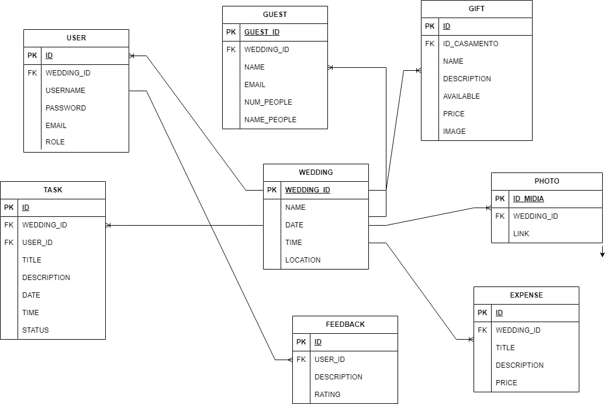
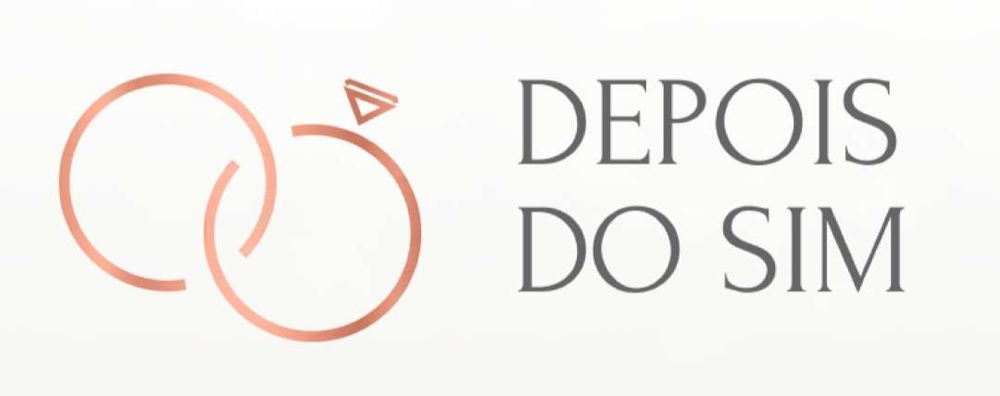

## 4. Projeto da solução

### 4.1. Modelo de dados

_Apresente o modelo de dados por meio de um modelo relacional ou Diagrama de Entidade-Relacionamento (DER) que contemple todos os conceitos e atributos apresentados na modelagem dos processos._ 

### 4.2. Tecnologias

_Descreva qual(is) tecnologias você vai usar para resolver o seu problema, ou seja, implementar a sua solução. Liste todas as tecnologias envolvidas, linguagens a serem utilizadas, serviços web, frameworks, bibliotecas, IDEs de desenvolvimento, e ferramentas. Apresente também uma figura explicando como as tecnologias estão relacionadas ou como uma interação do usuário com o sistema vai ser conduzida, por onde ela passa até retornar uma resposta ao usuário._

| **Dimensão**   | **Tecnologia**  |
| ---            | ---             |
| Persistência   | Hibernate       |
| Front end      | HTML+CSS+JS     |
| Back end       | Java SpringBoot |
| Log do sistema | Log4J           |
| Teste          | JUnit           |
| Deploy         | Github Pages    |

### 4.3. Guias de estilo

Nessa seção apresentaremos o design escolhido para nossa aplicação.

## Design

O design do site será baseado em cores claras e tons pastéis, que remetem à própria suavidade de uma cerimÔnia de casamento tradicional. A logo representa duas alianças entrelaçadas, demonstrando a própria união do casal. 

## Cores

## Tipografia

## Iconografia

